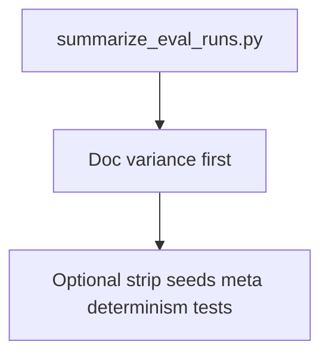

# Eval variance — lean plan

## Philosophy

**Comparability** comes from **repeated runs + aggregation**, not from near-deterministic single shots. Seeds, pinned API snapshots, and `meta.determinism` were partial mitigations with real maintenance cost and incomplete payoff (per existing measurements). It is reasonable to **remove that plumbing** and keep the stack simpler, as long as comparisons use **median (or min/max) over several runs**.

**One nuance — pinned judge model id:** A dated snapshot (e.g. `gpt-4o-mini-2024-07-18`) is less about “determinism” and more about **stable scoring over calendar time**: the rolling `gpt-4o-mini` alias can change behavior when the vendor updates it, so runs from different weeks are not strictly comparable. **Options:**

- **Simpler YAML:** use the rolling alias; accept occasional silent scorer drift; rely on multi-run aggregation for noise.
- **Slightly more discipline:** keep a dated snapshot in config with a short comment (“stable judge for trend comparison”); still no seeds required.

Pick one when executing `optional-simplify-plumbing`; both are valid.

---

## Core deliverables (do these)

### `scripts/summarize_eval_runs.py`

- **Input:** Multiple run directories `artifacts/eval_runs/<UTC>/` (CLI args).
- **Read:** Each `meta.json` only (`datasets[].pass_rate`, `datasets[].mean_scores` from [scripts/run_eval_report.py](scripts/run_eval_report.py)).
- **Output:** Per dataset key: min / max / median (std if N ≥ 3). Stdout is enough.

### Documentation

- Update [docs/determinism-2026-03-24.md](docs/determinism-2026-03-24.md): **lead with** “how to compare runs” (3+ evals, summarizer), empirical noise bands as **why** aggregation matters; **remove or shorten** sections that center on seeds/pinning as the story. Rename file only if you want (`variance-…`); optional.

---

## Optional simplification pass (`optional-simplify-plumbing`)

Remove or slim determinism-oriented wiring (only if you want a cleaner tree):

| Area                                                                 | Action                                                                                                                           |
| -------------------------------------------------------------------- | -------------------------------------------------------------------------------------------------------------------------------- |
| [configs/default.yaml](configs/default.yaml)                         | Drop `generation.seed` (and comment) if present                                                                                  |
| [configs/eval.yaml](configs/eval.yaml)                               | Drop `judge.generation_kwargs.seed` (and related comments)                                                                       |
| [src/rag/generator.py](src/rag/generator.py)                         | Stop passing `seed` into `chat.completions.create` if field removed                                                              |
| [src/eval/judge.py](src/eval/judge.py)                               | No change unless something exists solely for seed forwarding                                                                     |
| [scripts/run_eval_report.py](scripts/run_eval_report.py)             | Remove or replace `meta.determinism` with a minimal block (e.g. `judge_model`, `generation_model` strings only) or omit entirely |
| [tests/test_determinism_config.py](tests/test_determinism_config.py) | Delete or rewrite to assert whatever remains in config                                                                           |
| Judge `model`                                                        | User choice: dated snapshot vs rolling alias (see nuance above)                                                                  |

**Explicitly still not doing:** `system_fingerprint`, `--repeat` on the eval script, DeepEval `strict_mode` / `DAGMetric` for repeatability, CPU-only inference for bitwise stability.

---

## Implementation order

1. `summarize_eval_runs.py`
2. Doc refresh (variance-first + comparing runs + summarizer example)
3. Optional: simplification pass across config/code/tests

Optional: one sentence in [.cursor/skills/run-eval-report/SKILL.md](.cursor/skills/run-eval-report/SKILL.md) pointing at the summarizer.

