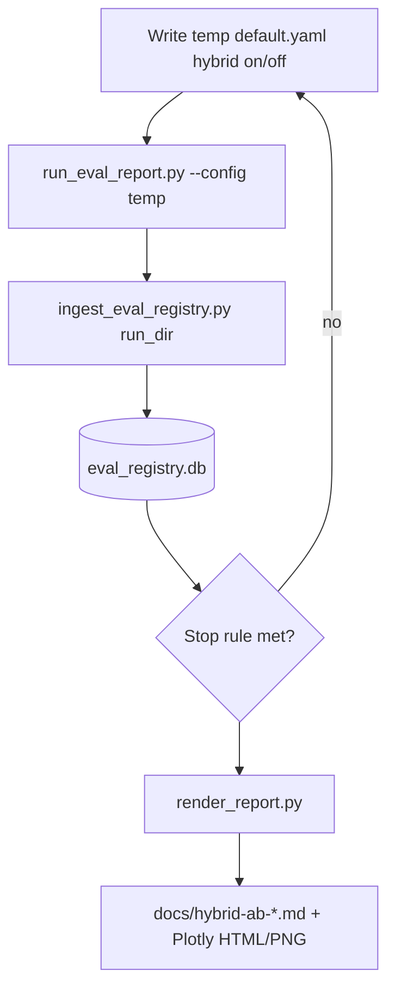

# Hybrid A/B “science loop” and report

## Statistical design (do this before code)

**Avoid naive “loop until p < 0.05”.** If you stop as soon as significance appears, the nominal α is wrong (optional stopping / peeking); you will **over-reject** nulls.

Pick one approach and document it in the generated report:

1. **Fixed-N (recommended for publishable claims):** Choose `n_per_arm` from your variance doc (e.g. **5+ runs per arm** for moderate effects on noisy metrics; see [docs/determinism-2026-03-24.md](docs/determinism-2026-03-24.md)). Run exactly `n` dense + `n` hybrid, **one** Welch `ttest_ind` (already in [scripts/compare_eval_configs.py](scripts/compare_eval_configs.py)), report p-value + means + CIs.
2. **Exploratory sequential (honest labeling):** Run up to `max_rounds` per arm, peek after each **pair** of runs, stop when `n >= n_min` **and** `p < alpha` **or** `n == max`. Label results **exploratory**; optionally use a stricter α or pre-planned sequential rule (out of scope unless you add a library).
3. **Paired design (lower variance):** For each “block” `i = 1..n`, run **dense then hybrid** (or randomize order within block) on the **same** dataset/corpus/index/judge snapshot, so each block contributes a paired difference. Use `ttest_rel` on block means (extend tooling to pass paired vectors). This is usually more powerful than independent arms for your setup.

The loop should encode **primary endpoint(s)** explicitly (e.g. `pass_rate` as mean of per-run pass rate, or `Faithfulness` mean score)—not “any metric significant” without multiple-comparison control.

## Implementation pieces

### 1. Config toggle without mutating repo YAML

- **Mechanism:** Load [configs/default.yaml](configs/default.yaml) with `yaml.safe_load`, set `retrieval.hybrid.enabled` to `True`/`False`, write a **temp file** (e.g. `artifacts/ab_study/default_hybrid_off.yaml`), pass `--config` to [scripts/run_eval_report.py](scripts/run_eval_report.py). Keeps git clean and matches how `meta.json` already records the config path (that path will point at the temp file—acceptable for traceability; alternatively copy base path string into a sidecar `manifest.jsonl` with logical `arm`).
- **Invariant:** Same corpus, same index, same [configs/eval.yaml](configs/eval.yaml) judge; only pipeline config differs. Do **not** re-ingest corpus mid-study unless intentional.

### 2. Orchestrator script (new)

Add e.g. [scripts/run_hybrid_ab_study.py](scripts/run_hybrid_ab_study.py) (name flexible) with arguments such as:

- `--dataset` / use existing eval-config enabled sets (mirror [scripts/run_eval_report.py](scripts/run_eval_report.py)).
- `--base-config` default `configs/default.yaml`.
- `--n-per-arm` (fixed-N mode) **or** `--max-per-arm` + `--min-per-arm` + `--alpha` (exploratory sequential).
- `--pairing {none,paired}`: if `paired`, alternate arms in blocks and use paired test logic when generating the report.
- `--run-eval-extra-args` passthrough for throttle flags.
- After each eval: subprocess or import `ingest_run_dir` from [src/eval/registry_ingest.py](src/eval/registry_ingest.py) into [data/eval_registry.db](data/eval_registry.db).

Persist a **machine-readable log** alongside artifacts: e.g. `artifacts/ab_study/<study_id>/manifest.jsonl` lines `{run_id, arm, config_path, timestamp}` so the report does not rely only on `hybrid_enabled` in DB (already populated via [scripts/run_eval_report.py](scripts/run_eval_report.py) `retrieval_features`).

### 2b. Judge / API failures (e.g. `LengthFinishReasonError`)

**What happens today:** [src/eval/judge.py](src/eval/judge.py) `TracedGPTModel` wraps `a_generate` / `generate`: on failure it **appends a structured JSONL record** (including OpenAI `usage`, `finish_reason`, capped assistant preview) to `RAG_EVAL_JUDGE_TRACE_PATH` when set by `run_eval_report.py`, then **re-raises**. [src/eval/runner.py](src/eval/runner.py) uses DeepEval `ErrorConfig(ignore_errors=False)`, so **the whole batch eval aborts** mid-dataset—no clean `meta.json` / full `report.json` for that stamp unless DeepEval flushed partial state (do not rely on it).

**Your traceback:** Faithfulness used structured `parse()`; the completion hit **16k output tokens** without a valid parse—often runaway or over-verbose model output on verdict JSON, not something fixed by “raise the limit” alone if the provider already caps there.

**Orchestrator behavior (planned):**

- Run `run_eval_report.py` as **subprocess**; on **non-zero exit**, append `manifest.jsonl` with `status: failed`, `error_hint` (stderr tail or known class), `arm`, intended `run_id` if known—**do not ingest** that folder into the registry (or ingest only runs with complete `meta.json` + all expected `report.json` files).
- `**--retries N`** (optional): retry the same arm with a **new** UTC stamp after backoff (same hybrid flag); cap total attempts so the study cannot run forever.
- **Report script:** show **completed vs failed attempts** (counts per arm) so the write-up is honest about missing data.

**Mitigations (config / ops, parallel to automation):**

- In [configs/eval.yaml](configs/eval.yaml) `judge.generation_kwargs`, tune `**max_completion_tokens`** only if the API allows headroom; if you already hit the model max, prefer **reducing judge input size** (e.g. fewer / shorter retrieval chunks for metrics—pipeline/product change) or a **different judge snapshot** with more stable structured outputs.
- **Throttling** (`--max-concurrent 1`, higher `--judge-throttle-seconds`) reduces rate-limit failures; it does not fix length blowups.
- Turning on DeepEval `**ignore_errors=True`** would let the run “finish” but yields **invalid or partial scores**—**avoid for A/B science** unless explicitly labeled as non-comparable.

**Out of scope unless added later:** resume-from-sample-N, automatic retry only for `LengthFinishReasonError`, or switching faithfulness to a non-schema path inside DeepEval.

### 3. Reuse and small extensions to stats

- Reuse DB queries like [scripts/compare_eval_configs.py](scripts/compare_eval_configs.py); optionally refactor **shared functions** into `src/eval/registry_stats.py` (load metric vectors for `dataset_key`, `hybrid_enabled` filter, run Welch/paired) so the orchestrator and report share one implementation.
- For **CIs on mean difference**: bootstrap over run IDs (optional, `numpy` already present) or report simple descriptive CIs per arm only in v1.

### 4. Report with graphics in `docs/`

- **Tooling:** [plotly](https://plotly.com/python/) is already in [pyproject.toml](pyproject.toml)—use it for box/violin plots of **per-run** `pass_rate` and per-metric means by `hybrid_enabled`, and a simple bar chart with error bars (std or bootstrap CI if implemented).
- **Output:** New script e.g. [scripts/render_hybrid_ab_report.py](scripts/render_hybrid_ab_report.py) that:
  - Reads `manifest.jsonl` + SQLite (or takes `--group-a-ids` / `--group-b-ids`).
  - Writes [docs/hybrid-ab-.md](docs/) with: **methods** (fixed vs exploratory, n, judge model from `eval_context`), **results** table, **figures** as `write_html` to `docs/_figures/hybrid-ab-<study_id>/` and markdown links, or static PNG via `kaleido` (optional extra dep—only add if you want PNG without opening HTML).
- **Diagrams:** One Mermaid flowchart in the markdown (pipeline + arms) is enough for “architecture”; metric plots are the main science visuals.

### 5. Documentation

- Short section in [docs/eval-registry.md](docs/eval-registry.md) linking the orchestrator + report script and the stopping-rule caveat.
- Optional one-line in [.cursor/skills/eval-registry/SKILL.md](.cursor/skills/eval-registry/SKILL.md) pointing at the A/B workflow.

## Testing

- **Unit:** Pure functions—build temp YAML from base dict (hybrid on/off); mock no eval—manifest append format.
- **Integration (optional):** Mark slow—single tiny dataset run if you add a `--dry-run` that only writes configs and exits.

## Out of scope (unless you expand later)

- Automatic correction for multiple metrics (Bonferroni/FDR).
- Bayesian A/B (e.g. `pymc`) or sequential probability ratio test.
- In-place editing of `configs/default.yaml` in the repo during the loop.

