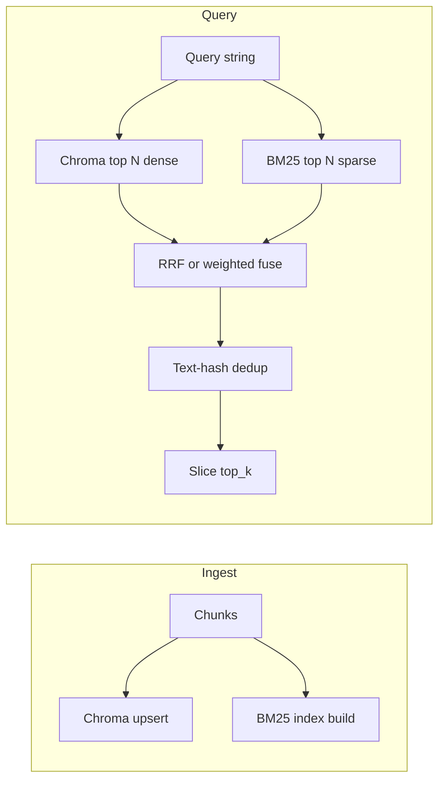

# Hybrid retrieval (dense + BM25) in this repo

## What it is (in your stack)

Today: **one signal** — cosine similarity in Chroma (`[src/rag/store.py](src/rag/store.py)` `query()` embeds the query and returns `top_k` chunks).

**Hybrid** adds a **second signal**: **BM25** over the same chunk texts. Queries that name exact tokens (`SKIP_DEPS`, `streamdeck-sunshine.service`, `udev`, file paths) often rank higher lexically than in embedding space alone. You then **merge two ranked lists** into one ordering before dedup / `top_k`.

This stays **earlier in the pipeline** than reranking: you change **what enters** the context window, not a third model on top.

## Fusion (recommended default: RRF)

**Reciprocal rank fusion** (no fragile score scaling): for each chunk id, `RRF(d) = sum 1/(k + rank_in_list)` across dense list and sparse list (fixed `k`, often 60). Sort by RRF descending. Ties broken deterministically (e.g. by `chunk_id`).

Alternative: normalize dense similarity and BM25 scores to [0,1] and use `alpha * dense + (1-alpha) * sparse` — needs tuning; keep as optional config later if you want.

## Where code lives

| Piece                           | Placement                                                                                                                                                                                                                                                                                                                                                                                                                                                                          |
| ------------------------------- | ---------------------------------------------------------------------------------------------------------------------------------------------------------------------------------------------------------------------------------------------------------------------------------------------------------------------------------------------------------------------------------------------------------------------------------------------------------------------------------- |
| Tokenize + BM25 corpus + query  | New small module, e.g. `[src/rag/bm25_index.py](src/rag/bm25_index.py)` — class `Bm25Index` with `build(chunks: list[Chunk])`, `search(query: str, top_k: int) -> list[tuple[chunk_id, score]]`, and **persist/load** (pickle or json+separate vocab — pickle is fine for dev corpus size).                                                                                                                                                                                        |
| Dense fetch at higher N         | Add `VectorStore.query_ids(query, n_results)` or overload `query(..., top_k)` — already exists; retriever will request `candidate_k` instead of only `2*top_k` when hybrid is on.                                                                                                                                                                                                                                                                                                  |
| Fuse + existing dedup           | Extend `[src/rag/retriever.py](src/rag/retriever.py)`: if hybrid enabled, `dense = store.query(q, candidate_k)`, `sparse = bm25.search(q, candidate_k)`, merge to `RetrievedChunk` list (rehydrate full `Chunk` + metadata: **either** BM25 returns ids only and you `collection.get(ids=...)` from Chroma for documents/metadatas, **or** BM25 stores id→text+meta snapshot at build — **Chroma `get` by id** keeps a single source of truth for text/metadata and avoids drift). |
| Build index when corpus changes | Call `bm25_index.build(all_chunks)` from `[src/rag/pipeline.py](src/rag/pipeline.py)` `ingest()` **after** `store.add_chunks` (same chunk list). Save to e.g. `data/embeddings/bm25_index.pkl` next to Chroma (path in config).                                                                                                                                                                                                                                                    |
| Reset                           | `[VectorStore.reset()](src/rag/store.py)` should be paired with deleting the BM25 artifact (pipeline `ingest --reset` path or document manual delete).                                                                                                                                                                                                                                                                                                                             |

**Dependency:** add a BM25 library to `[pyproject.toml](pyproject.toml)` (e.g. `rank-bm25` — simple API; or `bm25s` if you prefer a maintained/fast option). Tokenization: start with **regex word tokens + lowercasing** to avoid pulling NLTK; good enough for technical docs.

## Config (`[configs/default.yaml](configs/default.yaml)`)

Under `retrieval`, add a `hybrid` block (with comments per your repo convention), for example:

- `enabled: true` — hybrid on by default; set `false` to A/B against dense-only without removing code paths.
- `candidate_k: 20` — per channel fetch size before fusion (must be ≥ final `top_k` and large enough that fusion has room after dedup).
- `fusion: rrf` — enum-like string.
- `rrf_k: 60` — standard constant in RRF formula.
- `index_path: ./data/embeddings/bm25_index.pkl` — BM25 persistence path.

Pipeline `from_config` wires `Bm25Index.load_or_empty(path)` into `Retriever` when enabled; if enabled and file missing, **fail fast** at query time (or at ingest-only — your preference; fail-fast at query is clearer).

## Behavioral notes

- **Re-ingest required** whenever chunking or corpus changes (same as vectors). BM25 and Chroma must stay aligned on `chunk_id`.
- **Does not fix** pure corpus gaps (e.g. openbox never ingested); it helps when the **right chunk exists** but dense search ranks generic sections higher — complementary to your eval findings.
- **Latency:** one extra BM25 pass over the full corpus index is cheap vs embedding round-trip; dominant cost remains the embedding API for the query.

## Lightweight measurement (retrieval)

Add **small, structured timings** so hybrid vs dense-only regressions are visible without a full APM stack:

- In `[src/rag/retriever.py](src/rag/retriever.py)` (or pipeline right after `retrieve`): record wall-clock ms with `time.perf_counter()` for **dense query** (Chroma + embed query), **BM25 search** (when enabled), and **fuse + dedup + final slice** (usually negligible).
- **Surface:** extend `[src/data/schemas.py](src/data/schemas.py)` `RAGResult` with an optional `retrieval_timings_ms: dict[str, float] | None` (e.g. `{"dense": ..., "bm25": ..., "fuse": ...}`) populated in `[src/rag/pipeline.py](src/rag/pipeline.py)` `query()`, alongside any existing `latency_ms`. Keeps eval scripts and future dashboards able to aggregate without parsing logs.
- **Fallback:** if you want zero schema churn first, a single **debug log line** per query (gated on env or log level) with the same three numbers is enough for manual checks; migrate to `RAGResult` when you want CSV/report columns.

Use this to confirm BM25 adds only a few ms on your corpus size and to compare total retrieval time when toggling `hybrid.enabled`.

## Validation step

After implementation: `python -m src.rag.ingest ...` (reset), hybrid defaults on in YAML, run `[scripts/run_eval_report.py](scripts/run_eval_report.py)` on synthetic set and compare to 44% baseline on the same judge settings. Toggle `hybrid.enabled: false` for a controlled dense-only comparison.

## Out of scope (per your direction)

- Cross-encoder reranking.
- Chroma “native” sparse vectors (would couple you to Chroma versioning and migration); sidecar BM25 is explicit and matches your current architecture.

