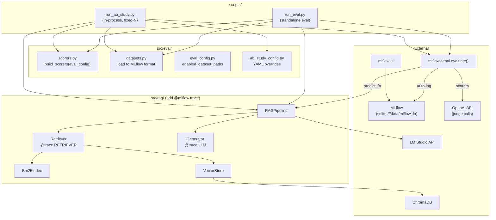
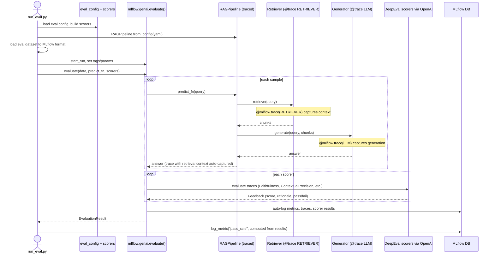
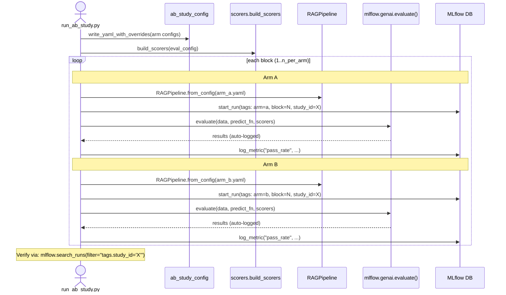
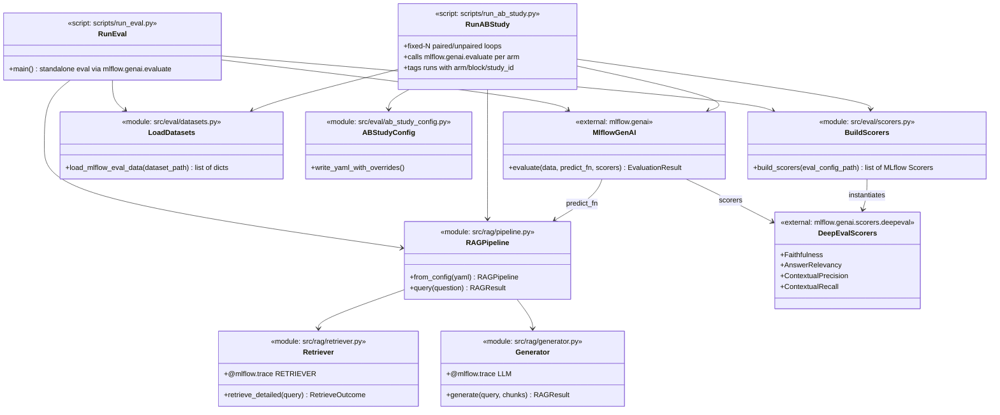

# MLflow-Idiomatic Refactor and Hybrid-vs-Dense Pilot

## Post-refactor architecture




Key insight: `mlflow.genai.evaluate()` is the only evaluation entry point. It calls `predict_fn` (which runs the traced pipeline), then passes traces + data to each scorer. Everything auto-logs.

## Key sequence: eval run




## Key sequence: A/B study




## Class diagram




---

## What changes

**Delete (entire eval pipeline + registry):**

- `[src/eval/runner.py](src/eval/runner.py)` -- replaced by `mlflow.genai.evaluate()`
- `[src/eval/metrics.py](src/eval/metrics.py)` -- replaced by MLflow DeepEval scorer instantiation
- `[src/eval/judge.py](src/eval/judge.py)` -- replaced by `model="openai:/gpt-4o-mini"` on scorers
- `[src/eval/report.py](src/eval/report.py)` -- replaced by MLflow UI + `search_runs()`
- `[src/eval/registry_db.py](src/eval/registry_db.py)`
- `[src/eval/registry_ingest.py](src/eval/registry_ingest.py)`
- `[src/eval/registry_stats.py](src/eval/registry_stats.py)`
- `[scripts/ingest_eval_registry.py](scripts/ingest_eval_registry.py)`
- `[scripts/query_eval_registry.py](scripts/query_eval_registry.py)`
- `[scripts/summarize_eval_runs.py](scripts/summarize_eval_runs.py)`
- `[scripts/compare_eval_configs.py](scripts/compare_eval_configs.py)`
- `[scripts/render_ab_study_report.py](scripts/render_ab_study_report.py)`

**Rewrite:**

- `[scripts/run_eval_report.py](scripts/run_eval_report.py)` -> `scripts/run_eval.py` (~80 lines, down from ~230): load config, build pipeline, build scorers, `mlflow.genai.evaluate()`
- `[scripts/run_ab_study.py](scripts/run_ab_study.py)` (~150 lines, down from ~500): in-process loops calling `mlflow.genai.evaluate()` per arm, tag runs

**Adapt:**

- `[src/eval/datasets.py](src/eval/datasets.py)` -- add `load_mlflow_eval_data()` that returns `list[dict]` in MLflow's `{"inputs": ..., "expectations": ...}` format
- `[configs/eval.yaml](configs/eval.yaml)` -- update judge config to use MLflow model URI format (`openai:/gpt-4o-mini`)

**Add:**

- `src/eval/scorers.py` (~30 lines) -- `build_scorers(eval_config_path)` reads thresholds from eval.yaml, returns list of MLflow DeepEval scorers
- `@mlflow.trace` decorators on `[src/rag/retriever.py](src/rag/retriever.py)` (`SpanType.RETRIEVER`) and `[src/rag/generator.py](src/rag/generator.py)` (`SpanType.LLM`)

**Keep unchanged:**

- All other `src/rag/` code, `src/eval/eval_config.py`, `src/eval/ab_study_config.py`, `src/data/`

---

## Implementation

### 1. Add dependencies, update config

Add `mlflow>=3.8.0` to `[pyproject.toml](pyproject.toml)` dependencies.

Update `[configs/eval.yaml](configs/eval.yaml)`:

- Add `tracking:` section with `uri` and `experiment_name`
- Change `judge.model` to MLflow URI format: `"openai:/gpt-4o-mini-2024-07-18"`

Add `data/mlflow.db` and `mlruns/` to `[.gitignore](.gitignore)`.

### 2. Add `@mlflow.trace` to RAG pipeline

In `[src/rag/retriever.py](src/rag/retriever.py)`, decorate `retrieve_detailed()` with `@mlflow.trace(name="retrieve", span_type=SpanType.RETRIEVER)`. Ensure the span output includes retrieval context as a list of document dicts so MLflow's DeepEval scorer can extract it.

In `[src/rag/generator.py](src/rag/generator.py)`, decorate `generate()` with `@mlflow.trace(name="generate", span_type=SpanType.LLM)`.

~10 lines total across both files. The rest of `src/rag/` is untouched.

### 3. Create `src/eval/scorers.py`

~30-line module. Reads `configs/eval.yaml` and returns a list of MLflow DeepEval scorers:

```python
from mlflow.genai.scorers.deepeval import (
    Faithfulness, AnswerRelevancy, ContextualPrecision, ContextualRecall
)

def build_scorers(eval_config_path):
    cfg = load_config(eval_config_path)
    model = f"openai:/{cfg['judge']['model']}"
    scorers = []
    if cfg['metrics']['faithfulness']['enabled']:
        scorers.append(Faithfulness(model=model, threshold=cfg['metrics']['faithfulness']['threshold']))
    # ... same pattern for other metrics
    return scorers
```

### 4. Adapt `src/eval/datasets.py`

Add `load_mlflow_eval_data(dataset_path) -> list[dict]` that loads the existing JSON format and converts to MLflow's expected structure:

```python
def load_mlflow_eval_data(dataset_path):
    dataset = load_eval_dataset(dataset_path)
    return [
        {"inputs": {"query": s.query}, "expectations": {"expected_output": s.expected_answer}}
        for s in dataset.samples
    ]
```

### 5. Rewrite `scripts/run_eval.py` (renamed from `run_eval_report.py`)

~80 lines. Core logic:

```python
mlflow.set_tracking_uri(tracking_uri)
mlflow.set_experiment(experiment_name)

pipeline = RAGPipeline.from_config(config_path)
eval_data = load_mlflow_eval_data(dataset_path)
scorers = build_scorers(eval_config_path)

def predict_fn(query: str) -> str:
    return pipeline.query(query).answer

with mlflow.start_run(run_name=stamp):
    mlflow.set_tag("hybrid_enabled", str(hybrid_enabled))
    mlflow.set_tag("git_commit", git_sha)
    mlflow.log_param(...)

    results = mlflow.genai.evaluate(data=eval_data, predict_fn=predict_fn, scorers=scorers)

    # Compute pass_rate from results (aggregate: fraction of samples where all scorers passed)
    mlflow.log_metric("pass_rate", computed_pass_rate)
```

### 6. Rewrite `scripts/run_ab_study.py` as in-process orchestrator

~150 lines. For each block in fixed-N mode:

```python
for block in range(n_per_arm):
    for arm, overrides, label in [(a_overrides, "a"), (b_overrides, "b")]:
        write_yaml_with_overrides(base_config, arm_config, overrides=overrides)
        pipeline = RAGPipeline.from_config(arm_config)
        
        with mlflow.start_run(run_name=stamp, tags={"arm": arm, "block": str(block), "study_id": study_id, ...}):
            results = mlflow.genai.evaluate(data=eval_data, predict_fn=predict_fn, scorers=scorers)
            mlflow.log_metric("pass_rate", computed_pass_rate)
```

No manifest.jsonl, no meta.json, no subprocess. MLflow tags on runs provide all the grouping needed. `mlflow.search_runs(filter_string="tags.study_id = '...'")` replaces the manifest.

### 7. Delete dead code

**src/eval (delete):** `runner.py`, `metrics.py`, `judge.py`, `report.py`, `registry_db.py`, `registry_ingest.py`, `registry_stats.py`

**scripts (delete):** `ingest_eval_registry.py`, `query_eval_registry.py`, `summarize_eval_runs.py`, `compare_eval_configs.py`, `render_ab_study_report.py`, `run_eval_report.py` (replaced by `run_eval.py`)

### 8. Verify retrieval context extraction

Before the pilot, run one standalone eval and verify that:

- The RETRIEVER span captures context documents
- DeepEval scorers (Faithfulness, ContextualPrecision, ContextualRecall) receive the retrieval context correctly
- Scores are comparable to the old pipeline

If the auto-extraction doesn't work, add a thin adapter that explicitly passes `retrieval_context` in the data format. This is the primary risk point.

### 9. Update skills and docs

- Rewrite `[.cursor/skills/eval-registry/SKILL.md](.cursor/skills/eval-registry/SKILL.md)` for MLflow
- Update `[.cursor/skills/science-loop/SKILL.md](.cursor/skills/science-loop/SKILL.md)` for `mlflow.genai.evaluate()` flow
- Update `[.cursor/skills/run-eval-report/SKILL.md](.cursor/skills/run-eval-report/SKILL.md)` for the new `run_eval.py`
- Update `[docs/eval-registry.md](docs/eval-registry.md)`

### 10. Write architecture document

Create `docs/ARCHITECTURE-<timestamp>.md` following the style of `[docs/ARCHITECTURE-2026-03-23T165311Z.md](docs/ARCHITECTURE-2026-03-23T165311Z.md)`. Include the diagrams from this plan plus updated class diagrams for the full system.

### 11. Pilot experiment: hybrid vs dense

```bash
.venv/bin/python scripts/run_ab_study.py \
  --dataset data/eval_datasets/synthetic.json \
  --arm-a-label "dense (hybrid off)" --arm-b-label "hybrid on" \
  --arm-a-overrides-json '{"retrieval.hybrid.enabled": false}' \
  --arm-b-overrides-json '{"retrieval.hybrid.enabled": true}' \
  --pairing paired --n-per-arm 3 \
  --max-concurrent 1 --judge-throttle-seconds 5
```

Verify in MLflow UI:

```bash
mlflow ui --backend-store-uri sqlite:///data/mlflow.db
```

Check: 6 runs visible, tagged with arm/block/study_id, each with Faithfulness/AnswerRelevancy/ContextualPrecision/ContextualRecall scores + pass_rate.

---

## Future (not in this refactor)

- **Statistical comparison layer** -- `mlflow.search_runs()` + scipy/pingouin for t-tests, bootstrap CIs, Cohen's d
- **Exploratory stopping** -- sequential stopping reading from MLflow
- **Report rendering** -- Plotly/markdown from `search_runs()` data
- **MLflow tracing UI** -- leverage trace visualization for debugging retrieval/generation failures
- **Judge alignment** -- use MLflow's `align()` to tune scorers with human feedback

