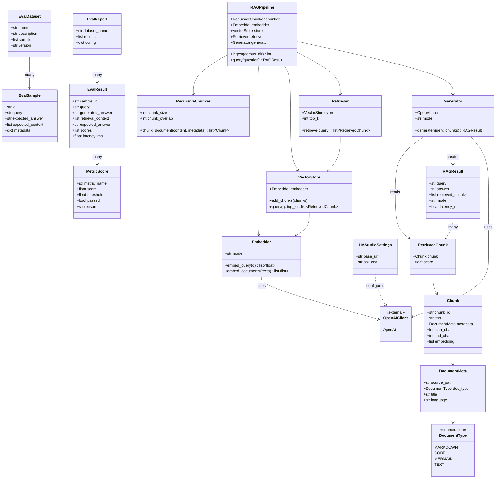
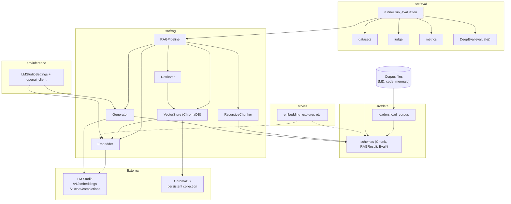
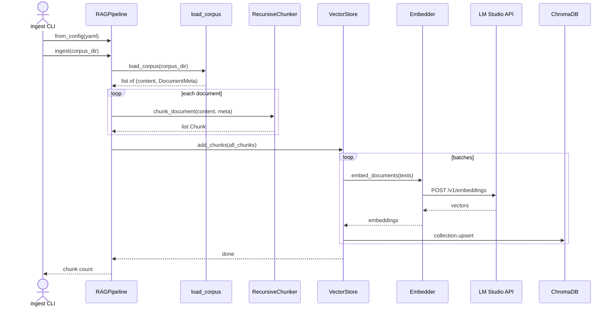
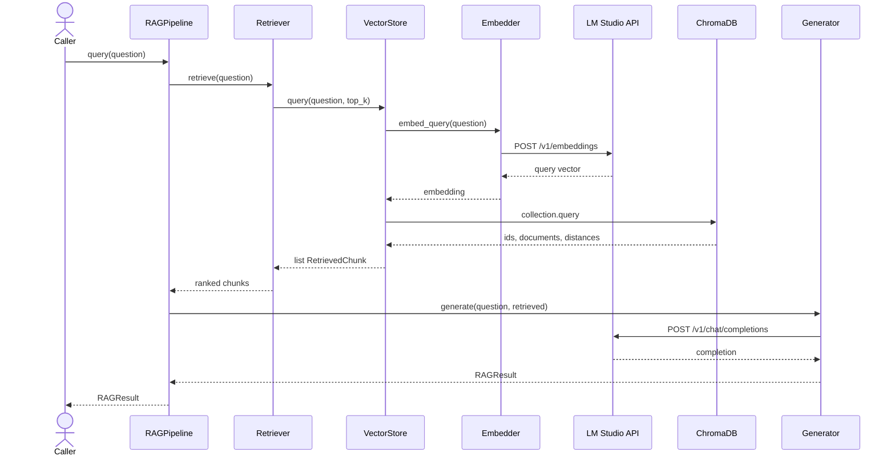
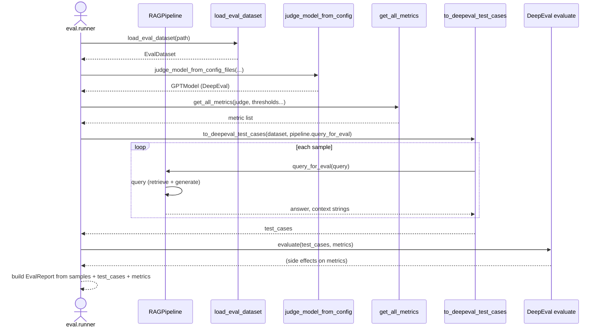

# RAG evaluation system — architecture

Generated: `2026-03-23T165311Z` (UTC). Diagrams reflect the current `src/` layout: RAG pipeline, LM Studio inference, ChromaDB storage, and the evaluation layer.

---

## Class diagram

Core domain models (`src/data/schemas.py`), pipeline composition (`src/rag/pipeline.py`), and main RAG services.

---

## Architecture diagram

Logical layers and external systems. Arrows show the primary data and control flow.

---

## Sequence diagrams

### 1. Corpus ingestion (`RAGPipeline.ingest` / `src.rag.ingest` CLI)

### 2. Query and answer (`RAGPipeline.query`)

### 3. Evaluation run (`run_evaluation`)

