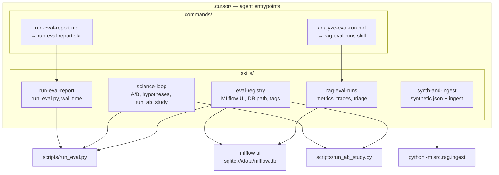
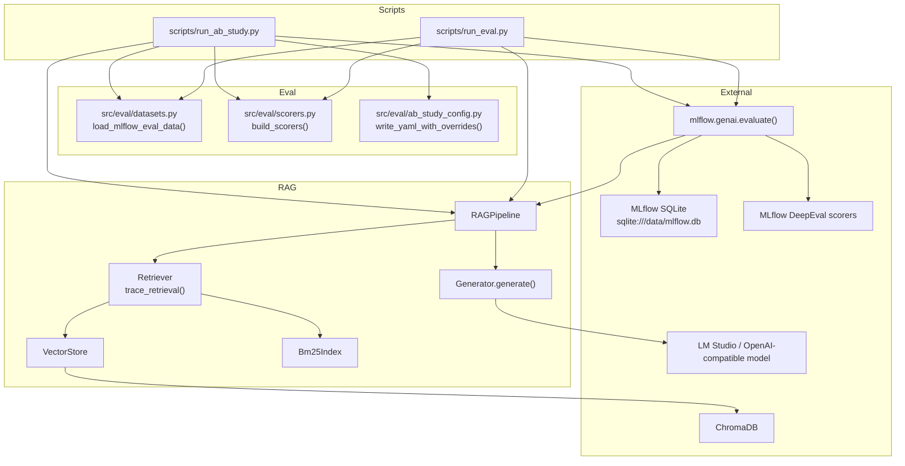
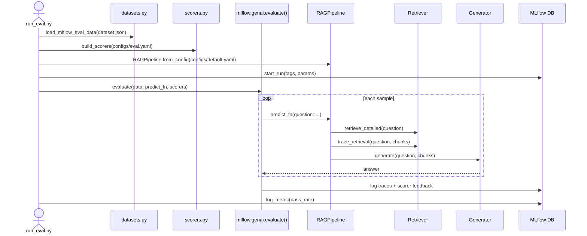
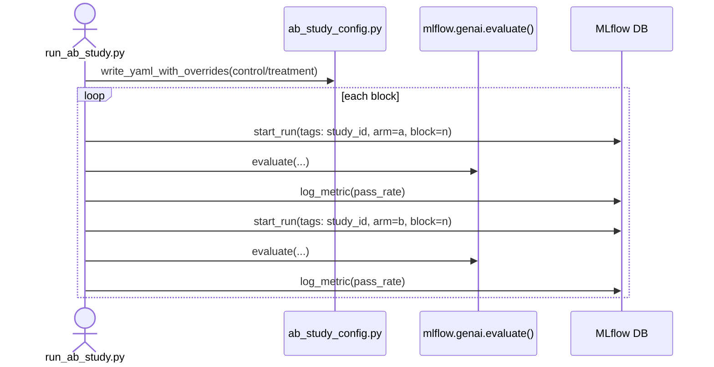
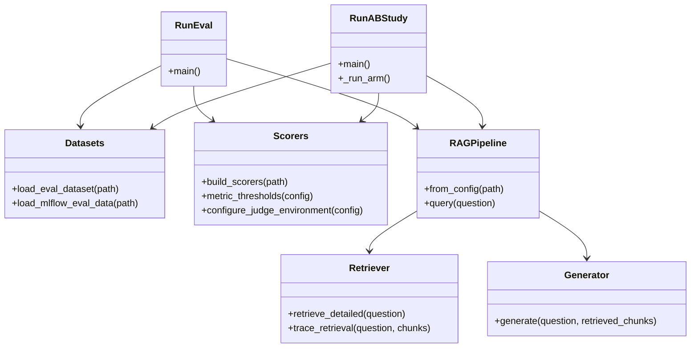

# Architecture Snapshot · 2026-03-25T103050Z

This snapshot reflects the MLflow-native evaluation refactor. The previous DeepEval runner, report, judge, and SQLite registry layers have been removed.

## Cursor skills and commands

Agent-facing docs live under `.cursor/`. **Skills** are long-form workflows; **commands** are short prompts that point agents at the right skill and script.

| Path | Role |
|------|------|
| `.cursor/skills/eval-registry/SKILL.md` | Tracking URI, `run_eval` / `run_ab_study`, filtering by `study_id` and dataset tags |
| `.cursor/skills/run-eval-report/SKILL.md` | Single eval runs via `scripts/run_eval.py`, timeouts, MLflow reporting |
| `.cursor/skills/rag-eval-runs/SKILL.md` | Read runs: faithfulness, relevancy, precision, recall; trace-based debugging |
| `.cursor/skills/science-loop/SKILL.md` | Preregistered A/B workflow, `run_ab_study.py`, fixed-N pairing |
| `.cursor/skills/synth-and-ingest/SKILL.md` | Corpus → `synthetic.json` → ingest (upstream of eval) |
| `.cursor/commands/run-eval-report.md` | Command wrapper → `run-eval-report` skill |
| `.cursor/commands/analyze-eval-run.md` | Command wrapper → `rag-eval-runs` skill (MLflow, not file reports) |

## System diagram

## Eval sequence

## A/B sequence

## Class diagram

