# Dev Log — 2026-03-23 / 24
## rag-eval-system · Zero to eval pipeline in two days — and discovering the judge is lying

> Two-day sprint to build a fully local RAG evaluation system from scratch. By end of day one the whole pipeline was running end-to-end. By end of day two the first meaningful benchmark result was in hand — and so was a clear-eyed view of why you should never trust a small model to judge its own answers.

---

## Day 1: Standing Up the System (2026-03-23)

The initial commit landed at 17:30 on the 23rd — 2,406 lines across 33 files, the whole thing in one shot. That's the advantage of designing it on paper before touching the keyboard: `src/rag/` (chunker, embedder, store, retriever, generator, pipeline, ingest), `src/eval/` (metrics, datasets, runner, report), and `src/viz/` (embedding explorer, eval dashboard) all landed together. The architecture was clear enough that the first thing to break wasn't the design — it was the inference backend.

The original plan was Ollama. Within 15 minutes of the first commit, Ollama was out and LM Studio was in. The `lms` CLI gives direct control over what's loaded, which matters when you need to swap between an embedding model and a chat model without restarting anything. The swap touched the config, the OpenAI-compatible client, and a new `src/eval/judge.py` module that would become central to the next day's work.

By 19:12, the smoke check was working — the eval runner could pick up a dataset, query the RAG pipeline, and hand the results to DeepEval for scoring. At 21:33 the first real corpus landed: documentation and logs from the `streamdeck` project, ingested and indexed. The system had something to actually retrieve from.

<div class="not-prose my-8 overflow-x-auto rounded-xl border border-white/10 bg-black/30 p-6">

```mermaid
timeline
    title 2026-03-23
    17:30 : Initial commit — full RAG + eval stack (2406 lines)
    17:43 : LM Studio replaces Ollama
    19:12 : Smoke check passing end-to-end
    21:33 : Streamdeck corpus added as first eval target
```

</div>

---

## Day 2 Morning: The First Real Run — and Its Problems (2026-03-24)

The morning started with two housekeeping improvements that turned out to matter: deterministic chunk IDs (so re-ingestion doesn't duplicate the index) and bounded DeepEval concurrency with CLI timeouts. DeepEval's default async behaviour can saturate a local LM Studio server fast — batching to `--max-concurrent 1` kept the run stable.

At 09:56 the judge and generation model were both switched to `mistralai/devstral-small-2-2512`. Devstral is a code-focused instruct model — locally hosted on the RTX 3090, free to run, and fast enough. The first full 25-sample eval completed at pass rate **32%** (8/25). Not great, but it's a baseline.

Then came the uncomfortable analysis. Reading through the per-sample scores in `artifacts/eval_runs/20260324T085932Z/single/report.md`, a pattern emerged: the judge was making mistakes. Not small scoring errors — category errors.

The most egregious case was **syn003**: the generated answer said "the context does not explicitly state..." — a correct abstention. The judge scored Faithfulness at **0.00**, claiming the answer "fails to acknowledge the context gap." That is the opposite of what the answer said. Simultaneously, the same judge gave Answer Relevancy **0.83** — "correctly answers the main question." You cannot correctly answer a question and simultaneously fail to acknowledge the context gap. The judge contradicted itself within the same sample.

**syn003's Contextual Recall** added insult: the judge scored it **0.00**, claiming no retrieval node supported the expected answer. But retrieval node 3 literally contained:

> "After a successful install, `/etc/streamdeck/install.conf` is created (mode 644) with: STREAM_USER, BUDDY_USER, STREAM_DISPLAY, STREAM_GROUP"

That's a verbatim match. The judge hallucinated its own evaluation result.

By 10:44, this was all documented. The root cause: DeepEval's faithfulness and recall metrics require NLI-style claim decomposition and verification. Devstral-small is a code model — it underperforms on the nuanced multi-hop reasoning that scoring demands. With ~8 of 25 samples showing judge errors, the 32% pass rate wasn't a meaningful signal.

---

## Day 2 Afternoon: Cloud Judge via Zen (2026-03-24)

The fix was adding a provider-selectable cloud judge. The architecture already had `src/eval/judge.py` as an abstraction point; the change at 10:57 made the judge provider configurable in `configs/eval.yaml` — local LM Studio or an OpenAI-compatible cloud endpoint. Rate-limiting throttling landed at 11:20 to stay within API quotas.

The second run at 14:xx used **GPT-4o-mini** as judge (via Zen, same generation pipeline). The result: **40%** pass rate (10/25).

The headline number buries the real finding. The Contextual Recall metric swung from **0.657 mean with devstral** to **0.931 mean with GPT-4o-mini**. Devstral failed CR on 12 of 25 samples; GPT-4o-mini failed it on exactly 1 — syn023, which is a genuine total retrieval miss (both Contextual Precision and Recall = 0.0, and the model correctly said it couldn't answer). Every other CR failure devstral logged was a judge error. GPT-4o-mini correctly handles abstention answers consistently — syn001, syn003, syn006, syn023 all flipped from Faithfulness = 0.0–0.5 to 1.0.

```mermaid
xychart-beta
    title "Mean Metric Scores — Devstral vs GPT-4o-mini Judge"
    x-axis ["Faithfulness", "Answer Relevancy", "Ctx Precision", "Ctx Recall"]
    y-axis "Score" 0 --> 1
    bar [0.757, 0.822, 0.770, 0.657]
    bar [0.809, 0.819, 0.781, 0.931]
```

<div class="not-prose my-8 overflow-x-auto rounded-xl border border-white/10 bg-black/30 p-6">



</div>

GPT-4o-mini isn't perfect — it over-scored Contextual Recall for syn006 and syn013 (scoring CR = 1.0 while simultaneously scoring Contextual Precision = 0.0 on the same nodes, a logical contradiction). But it made that mistake on 2 samples versus devstral's ~8. At $0.06 per 25-sample run, it's the better default.

---

## Day 2 Evening: RAG Fixes (2026-03-24)

With a trustworthy judge in hand, the actual RAG failures came into focus:

**Corpus hygiene first.** The `logs/` directories had been getting ingested — hundreds of `systemctl status` output blocks, many near-identical. That was filling the index with noise. A one-line config exclusion fixed it at 16:38.

**Retrieval deduplication.** syn004 exemplified the core problem: the retriever returned 4 near-identical `systemctl status` chunks, consuming 4 of 5 retrieval slots. The fix in `src/rag/retriever.py` added text-hash deduplication after the vector store query — over-fetch `2 × top_k`, discard duplicates, return up to `top_k` unique chunks. The generator gets a full context window even when duplicates are removed.

**System prompt grounding.** Six faithfulness failures (syn007, syn011, syn012, syn017, syn018, syn025) shared a pattern: the model supplemented retrieved context with pre-training knowledge. The prompt previously said "always ground your answers" — soft guidance. The new prompt says "Answer using ONLY the provided context. Do not add information from your own knowledge." That's a prohibition, not an aspiration.

**Chunk size.** `chunk_size=512` was producing ~100-token chunks — too small for multi-fact queries. The config bump to 1024 chars with 128-char overlap roughly doubles the information density per retrieval slot. With `top_k=5`, that's ~5,120 chars of context vs. ~2,560 before.

The RAG improvements landed in four commits between 16:38 and 16:48. A follow-up eval run with these changes against the 40% baseline is the next step.

---

## Screenshots

First eval run — 25 samples processing in parallel via DeepEval's async runner, with devstral-small handling all four metrics simultaneously:


Cloud judge (minimax-m2.5 in an intermediate test run) — note the multiple concurrent metric passes:


---

## Eval Results Summary

| Run | Judge | Pass Rate | Key Metric |
|-----|-------|-----------|-----------|
| `20260324T085932Z` | devstral-small | 32% (8/25) | CR mean: 0.657 |
| `20260324T142044Z` | GPT-4o-mini | 40% (10/25) | CR mean: 0.931 |

Estimated "true" pass rate accounting for GPT-4o-mini's remaining inconsistencies: **40–44%**.

---

## What's Next

- Re-run the 25-sample synthetic eval after the chunking + dedup + prompt changes land — measure against the 40% baseline
- Investigate the 12 stable failures (syn002, syn004, syn006, syn013, syn016, syn023 are the worst) — which are retrieval misses vs. generation failures vs. genuine corpus gaps
- Consider bumping `top_k` from 5 → 7 after observing whether 1024-char chunks resolve the multi-fact recall problem on their own
- AST-aware chunking for code files is on the roadmap (chonkie's `CodeChunker` via tree-sitter)
