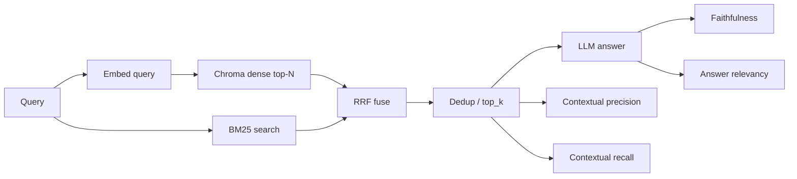

# Eval run after hybrid retrieval (dense + BM25)

**Run id:** `20260324T195433Z`  
**Artifacts:** `artifacts/eval_runs/20260324T195433Z/single/` (`report.md`, `report.json`, `report.csv`)  
**Dataset:** `data/eval_datasets/synthetic.json` (25 samples, key `single` in `meta.json`)  
**Context:** First full eval after implementing [hybrid dense + BM25 + RRF](../.cursor/plans/hybrid_dense_+_bm25_53a717c4.plan.md): BM25 sidecar index, `VectorStore.get_chunks` for rehydration, reciprocal rank fusion before dedup/`top_k`. Hybrid is on in `configs/default.yaml` (`retrieval.hybrid.enabled: true`, `candidate_k: 20`, `rrf_k: 60`).

**Models (from `meta.json`):** generation `mistralai/devstral-small-2-2512` (temperature 0); judge `gpt-4o-mini-2024-07-18` (temperature 0).  
**Thresholds:** core metrics 0.7, retrieval metrics 0.6.

---

## Headline

- **Pass rate: 52%** (13/25). A sample counts as a pass only if **all** four DeepEval metrics meet their thresholds.
- **Strongest on average:** Contextual Recall (0.936) and Contextual Precision (0.884) — retrieval is bringing in gold-aligned and mostly well-ordered context relative to this judge set.
- **Weakest on average (but still above thresholds in the mean):** Faithfulness (0.801) and Answer Relevancy (0.811). Failures cluster where the **generator** misreads context, over-asserts, or the **judge** flags precision/ordering on borderline lists.

The implementation plan suggested comparing to a dense-only baseline at **the same judge settings**; toggle `retrieval.hybrid.enabled: false` and re-run `scripts/run_eval_report.py` for a controlled A/B. Do not compare this headline number directly to [eval-findings-2026-03-24.md](eval-findings-2026-03-24.md) (that run used Devstral as judge; this run uses `gpt-4o-mini`).

---

## Metric averages

| Metric | Mean | Threshold |
|--------|------|-----------|
| Faithfulness | 0.801 | 0.70 |
| Answer Relevancy | 0.811 | 0.70 |
| Contextual Precision | 0.884 | 0.60 |
| Contextual Recall | 0.936 | 0.60 |

---

## Failing samples (query id → failed metric(s) → one-line read)

| Id | Failed metric(s) | Judge reason in one sentence |
|----|------------------|------------------------------|
| syn001 | Answer relevancy | Model abstained on groups despite retrieval containing `STREAM_USER` and group list — judge scored full miss on relevance. |
| syn002 | Faithfulness | Answer implied manual-deps narrative that contradicted how `SKIP_DEPS` is described in context. |
| syn005 | Contextual recall | Gold expected explicit Xorg flags / `-novtswitch` / `-sharevts`; judge said those sentences were not supported by retrieved nodes (retrieval gap or chunk boundary). |
| syn006 | Answer relevancy | Abstention instead of stating template values the judge believed were in the retrieved chunks. |
| syn007 | Faithfulness | Listed ports not grounded in retrieved text (hallucinated or merged from priors). |
| syn011 | Faithfulness, contextual precision | Wrong detail on TMPDIR vs fixed key; judge also claimed all top chunks were irrelevant to IPC primitives (metric/judge vs ordering artifact). |
| syn014 | Answer relevancy | Answer framed exit 134 around “different user” with tangents; judge wanted tighter tie to semaphore permission narrative. |
| syn017 | Faithfulness, contextual precision | Answer asserted udev details the judge said were unsupported; precision low because “right” node ranked fifth. |
| syn020 | Answer relevancy | Abstention on resolution/Modeline while judge scored recall/precision as if chunks had the answer. |
| syn022 | Faithfulness | Wording on `wait-all` vs stream lifecycle misaligned with judge’s reading of context. |
| syn023 | Contextual precision | Judge scored all retrieved nodes irrelevant to how Openbox is started (possible corpus gap or retrieval miss for that procedural snippet). |
| syn025 | Faithfulness | Grep pattern / keywords in answer did not match judge’s view of `collect-logs.sh` context. |

---

## Root-cause buckets (primary)

| Bucket | Samples (illustrative) | Implication |
|--------|------------------------|-------------|
| **Generation** | syn002, syn007, syn014, syn022, syn025 | Context often sufficient; model over-specifies, wrong mechanism, or invents detail — prompt/grounding/temperature already 0; check answer format and “cite only context” rules. |
| **Retrieval / corpus** | syn005, syn023 | Gold or question needs a specific snippet; hybrid did not surface it — chunking, corpus coverage, or `candidate_k` / fusion tuning. |
| **Metric / judge artifact** | syn001, syn006, syn011, syn017, syn020 | Abstention vs “answer from context” and strict precision narratives; cross-metric tension (high recall, low relevancy). Worth spot-checking `report.json` rows before overfitting the pipeline. |
| **Ordering (precision)** | syn011, syn017 | Right evidence exists but not at top ranks after RRF — inspect fused ranks; consider lexical query terms or `candidate_k`. |

---

## Pipeline + eval attachment (Mermaid)

---

## Suggested next steps (repo-local)

1. **Dense vs hybrid A/B** at fixed judge: `retrieval.hybrid.enabled: false` vs `true`, same `meta.json` judge block.
2. **Inspect failures** with the worst contextual recall (e.g. syn005) in `report.json`: retrieved chunk ids/text vs gold.
3. **Generation** tweaks in `src/rag/pipeline.py` / prompts: reduce invented lists (ports, grep patterns) when context is partial.
4. **Re-ingest** after corpus/chunk changes so BM25 and Chroma stay aligned (`bm25_index.pkl` + Chroma).

---

## References

- Run metadata: `artifacts/eval_runs/20260324T195433Z/meta.json`
- Config: `configs/default.yaml` (`retrieval.hybrid`), `configs/eval.yaml` (datasets)
- Plan: `.cursor/plans/hybrid_dense_+_bm25_53a717c4.plan.md`
